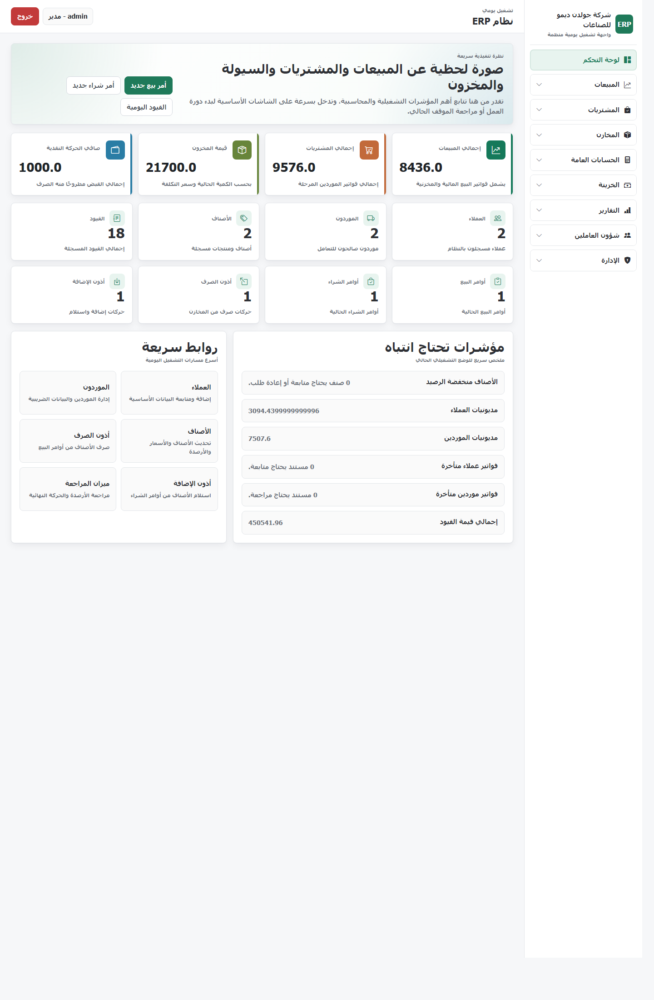
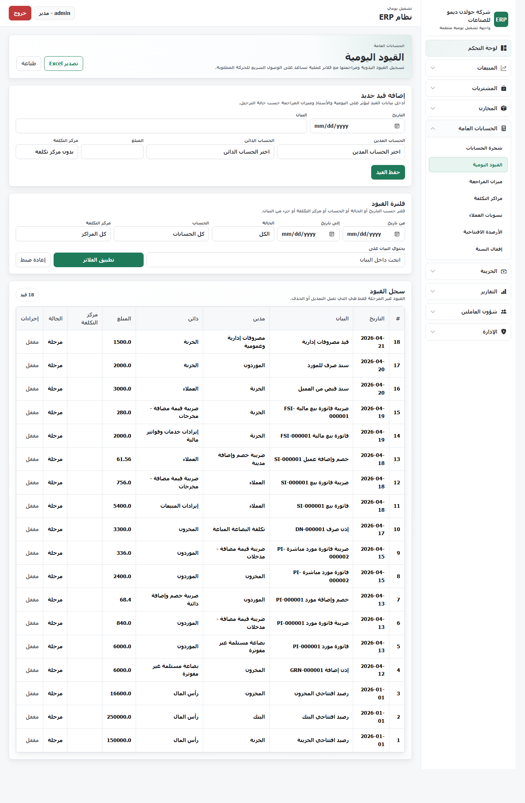
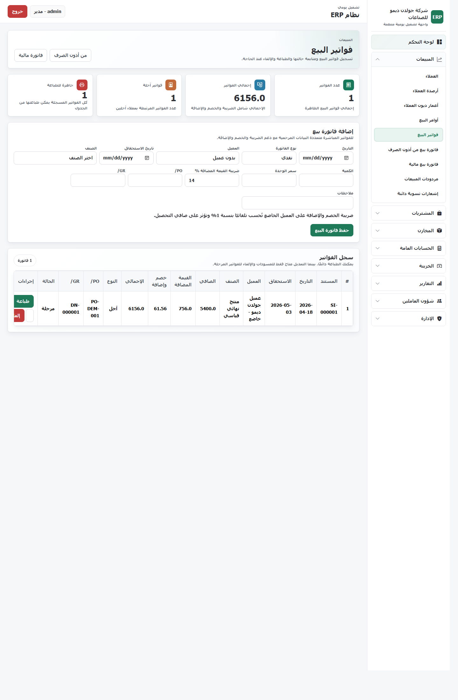
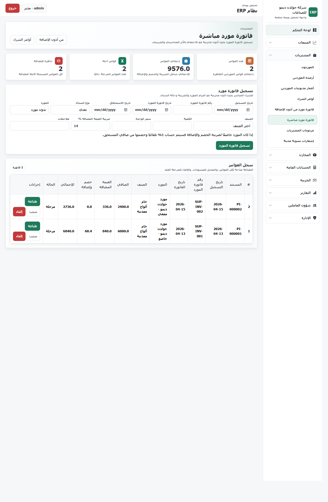
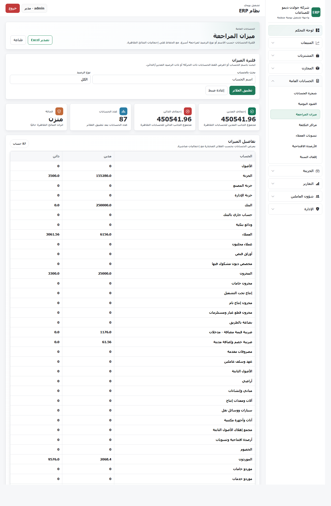

# نظام ERP محاسبي وإداري



نظام ERP مبني بـ `Flask` و `SQLite` لإدارة الدورة التشغيلية والمحاسبية اليومية داخل الشركات التجارية والصناعية، مع واجهة عربية مناسبة للعمل اليومي، ودورة مستندية مترابطة من الأوامر إلى الفواتير ثم القيود والتقارير.

## ما هو النظام؟

هذا المشروع هو نظام تخطيط موارد مؤسسة خفيف وسريع، يركز على:

- إدارة المبيعات والمشتريات
- متابعة العملاء والموردين
- إدارة المخزون وأذون الإضافة والصرف
- تشغيل القيود اليومية ودفتر الأستاذ وميزان المراجعة
- إصدار المستندات والطباعة والتقارير الأساسية

## ماذا يفعل؟

يدعم النظام دورة عمل عملية يمكن تتبعها بوضوح:

1. **أمر شراء / أمر بيع**
2. **إذن إضافة مخزني / إذن صرف مخزني**
3. **فاتورة مورد / فاتورة بيع**
4. **سند قبض / سند صرف**
5. **قيود يومية + أستاذ + ميزان مراجعة + تقارير**

كما يدعم:

- ضريبة القيمة المضافة
- ضريبة الخصم والإضافة للعملاء والموردين الخاضعين
- مردودات المبيعات والمشتريات
- تسويات مدينة ودائنة
- فترات مالية وترحيل وفك ترحيل
- صلاحيات مستخدمين وسجل مراجعة

## أهم المميزات

- **واجهة عربية عملية** مع تنظيم واضح للشاشات والقائمة الجانبية
- **دورة مستندية مترابطة** بين الأوامر والمخازن والفواتير والحسابات
- **تقارير محاسبية أساسية** مثل اليومية، الأستاذ، ميزان المراجعة، وكشوف الحساب
- **جاهزية عرض قوية** عبر Golden Demo نظيف ومتزن محاسبيًا
- **طباعة للمستندات الرئيسية** مثل فواتير البيع والشراء وسندات القبض والصرف
- **فلاتر عملية** في اليومية، الأستاذ، العملاء، الموردين، المخزون، والتقارير

## لقطات من النظام

### لوحة التحكم


### قيود اليومية


### فواتير البيع


### فواتير الموردين


### ميزان المراجعة


## موديولات النظام

- **لوحة التحكم**: مؤشرات سريعة وملخصات تشغيلية
- **المبيعات**: العملاء، أوامر البيع، فواتير البيع، المردودات
- **المشتريات**: الموردون، أوامر الشراء، فواتير الموردين، المردودات
- **المخازن**: الأصناف، أذون الإضافة، أذون الصرف، حركة المخزون
- **الحسابات**: شجرة الحسابات، القيود، الأستاذ، ميزان المراجعة
- **الخزينة**: سندات القبض والصرف
- **التقارير**: تقارير العملاء والموردين والمخزون والتقارير المالية
- **الإدارة**: الشركة، الفترات المالية، الصلاحيات، المستخدمون، سجل المراجعة

## بيانات الديمو الحالية

نسخة الديمو الحالية تتضمن سيناريو ذهبي منظم يحتوي على:

- 2 عميل
- 2 مورد
- 2 صنف
- أوامر بيع وشراء
- أذون إضافة وصرف
- فواتير بيع وشراء
- سند قبض وسند صرف
- قيود يومية وأستاذ وميزان مراجعة متزن

تفاصيل السيناريو موجودة في:

- [GOLDEN_DEMO_GUIDE.md](GOLDEN_DEMO_GUIDE.md)
- [DEMO_READY_REPORT.md](DEMO_READY_REPORT.md)
- [QA_STATUS_REPORT.md](QA_STATUS_REPORT.md)

## تشغيل النظام محليًا

```bash
python app.py
```

ثم افتح:

```text
http://127.0.0.1:5000
```

بيانات الدخول الافتراضية للديمو:

- **اسم المستخدم:** `admin`
- **كلمة المرور:** `1234`

## ملاحظات

- النسخة الحالية موجهة كنسخة تطوير وعرض متقدم
- تم الحفاظ على شجرة الحسابات وبيانات الديمو الأساسية
- ما زالت هناك مساحة لتحسينات إضافية في التشطيب النهائي وبعض الرسائل الثانوية
